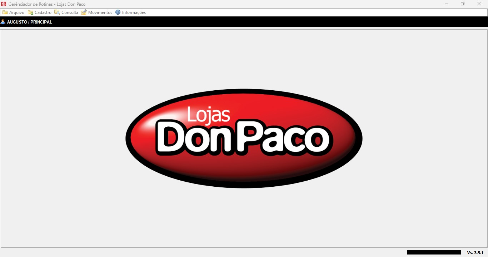
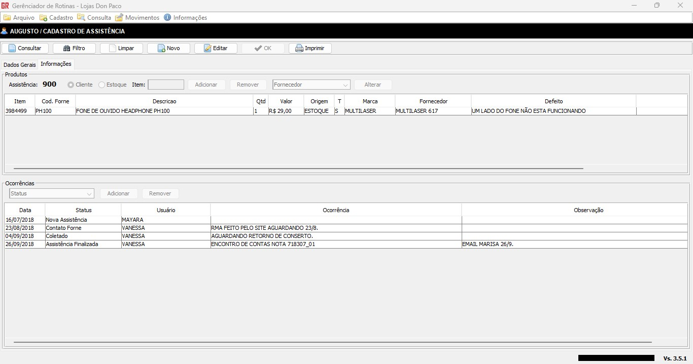
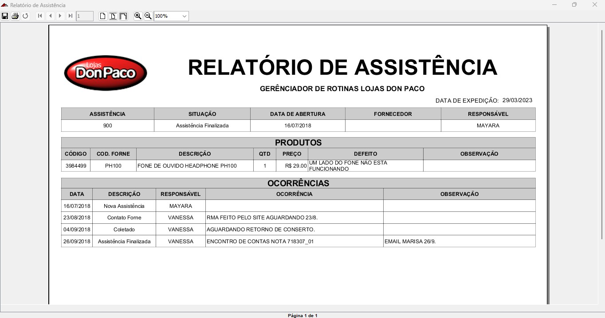
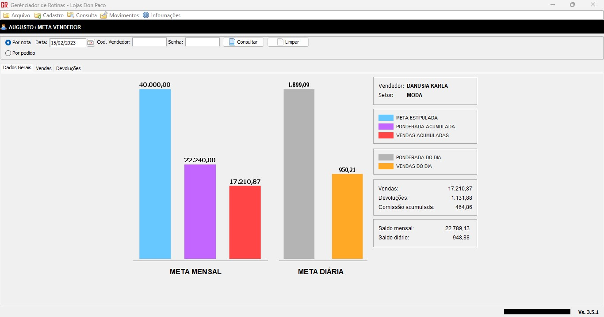
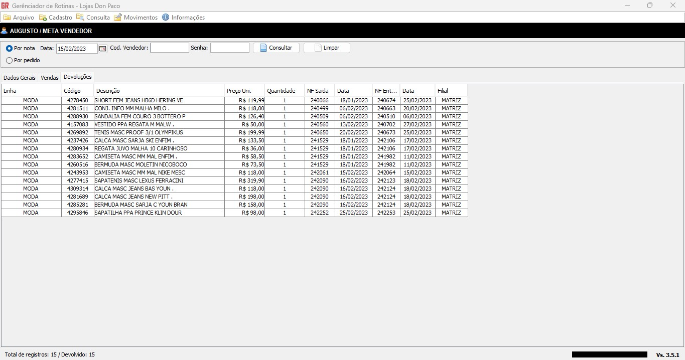
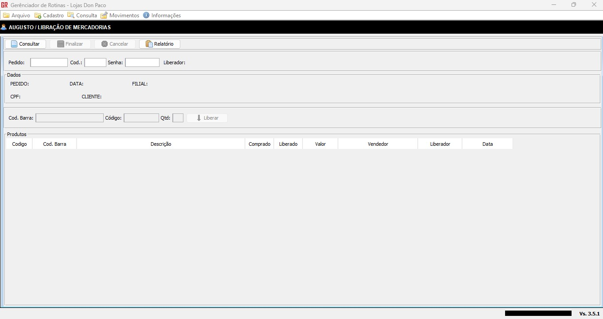
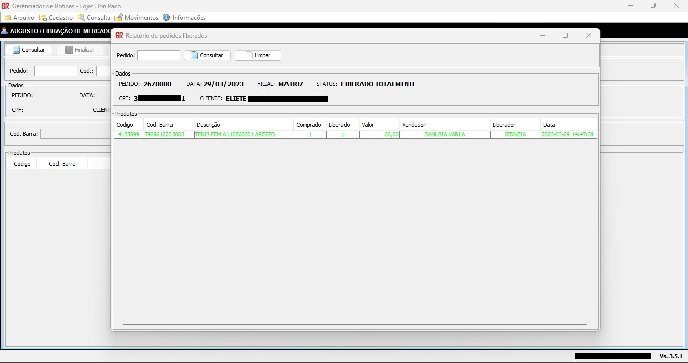
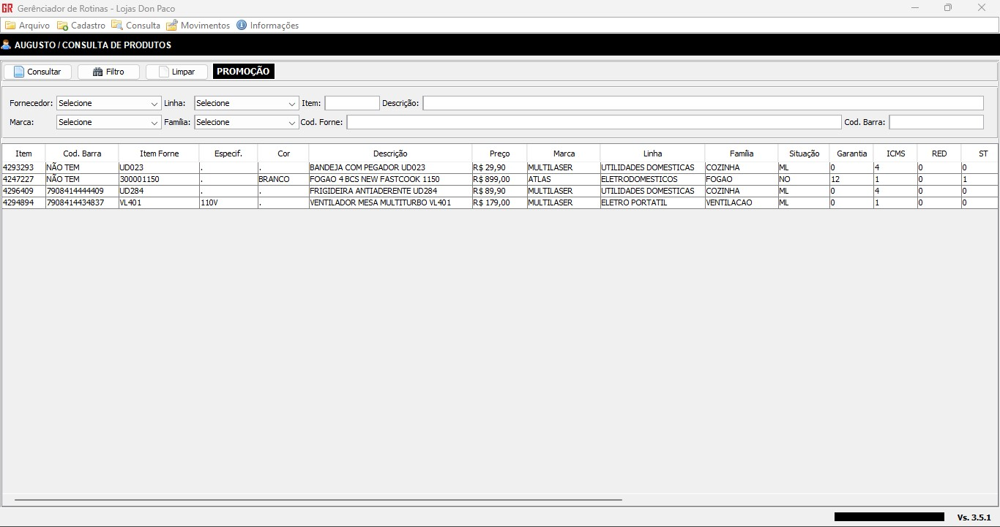
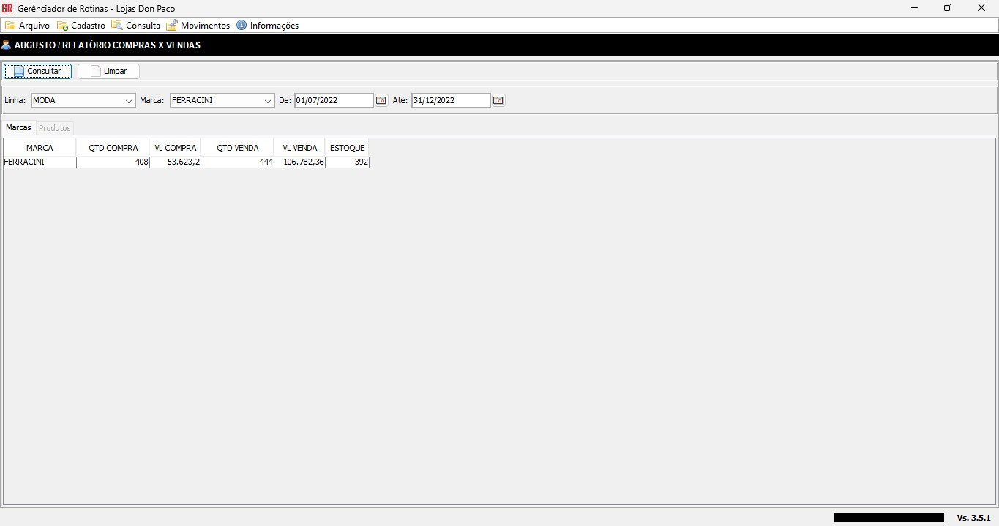
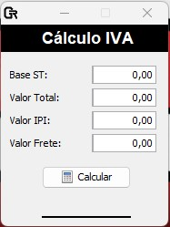

# Gerenciador de Rotinas

Este projeto foi desenvolvido para a empresa [Lojas Don Paco](https://www.donpaco.com.br/), para suprir processos não atendidas pelo ERP da empresa, seus principais módulos são:

- Gerenciamento de assistência técnica;
- Controle de liberação de mercadorias;
- Dashboard para acompanhamento de metas e venda;
- Relatórios;
- Pesquisa de produtos com detalhamento fiscal;
- Cálculo de impostos.

## Tecnologias

- Linguagem de programação: Java
- Telas: Java Swing
- Conexão com banco de dados: JDBC
- Banco de dados: SQL Server
- Biblioteca de relatórios: iReport

## Imagens do projeto

1.  Tela inicial
    

2.  Consulta de assistência
    

3.  Cadastro de assistência
    

4.  Relatório de assistência
    

5.  Consulta de metas
    

6.  Consulta de metas - vendas
    

7.  Consulta de metas - devoluções
    

8.  Liberação de mercadorias
    

9.  Relatório de liberação de mercadorias
    

10. Consulta de produtos com detalhamento fiscal
    

11. Relatório de compra x vendas
    

12. Cálculo de IVA
    
